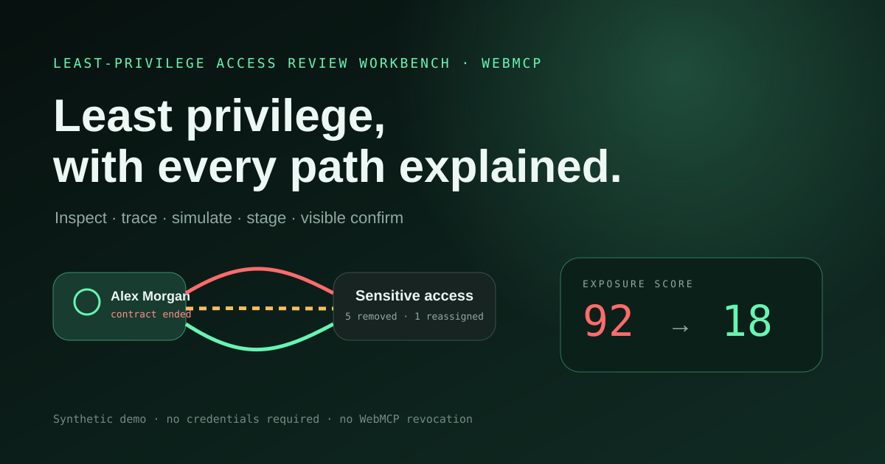

# Least-Privilege Access Review Workbench

A small, deterministic WebMCP Challenge submission that turns a SaaS offboarding
question into an inspectable least-privilege review. The app traces every effective
path, simulates removal, catches one shared-service breakage, revises the plan,
stages it, and stops at a visible confirmation control that is not exposed as a
WebMCP tool.



## Live demo and source

- **Live HTTPS demo:** https://webmaxru.github.io/webmcp-access-review-workbench/
- **Challenge gallery:** https://webmaxru.github.io/webmcp-challenge/
- **Source repository:** https://github.com/webmaxru/webmcp-access-review-workbench
  (private by instruction; it must be made public before Devpost submission)
- **Narrated rehearsal storyboard:** `submission-assets/demo-draft.mp4`
  (watermarked draft, not the required real Codex capture)

## What the demo proves

- A synthetic organization of 50 users, 10 groups, and 3 applications.
- Alex Morgan has exactly 4 effective paths producing 6 sensitive capability grants.
- Paths cover a direct role, cycle-safe nested groups, a personal API token, and an
  inherited project membership.
- A first simulation exposes one Incident Relay rollback breakage.
- The safe plan removes exactly 5 unnecessary grants and reassigns exactly 1 shared
  on-call dependency.
- WebMCP can inspect, trace, simulate, preview, stage, cancel, and read a receipt.
- No WebMCP tool confirms or revokes. The normal visible page control commits the
  mocked review and creates a read-only receipt. Ordinary browser actuation may
  still reach that control, subject to Codex/browser safety confirmation.
- After confirmation, current access reads report 0 sensitive grants for Alex and
  1 rollback grant owned by `svc-oncall-relay`.

All data and effects are deterministic and in-memory. No secret, login, backend, or
external API is required.

## Run locally

Requirements: Node.js 20.19+ or 22.12+.

```powershell
npm install
npm run dev
```

Open the local URL printed by Vite. For a production check:

```powershell
npm test
npm run typecheck
npm run build
npm run scan:webmcp
```

## Architecture

```text
Top-level index.html
  └─ src/main.tsx
      ├─ creates one AccessReviewService
      ├─ renders React UI with useSyncExternalStore
      └─ registers imperative WebMCP tools in the top-level document
           └─ every tool calls the same domain service as the rehearsal/UI

src/domain.ts
  ├─ deterministic organization and graph fixture
  ├─ cycle-safe membership traversal
  ├─ access path/risk/simulation logic
  └─ versioned staging, visible confirmation, current ownership, and receipt state
```

The service updates its immutable external-store snapshot and notifies React
subscribers synchronously before a tool returns. Tools do not yield after mutation,
so cancellation cannot turn a committed state transition into a reported failure.
Registration starts the tool group together and rejects on the first failure. It
immediately unregisters every successfully initiated name and aborts the lifecycle
without waiting for slower registrations, while consuming their later settlements
to avoid unhandled rejections. It uses an `AbortController`, prefers
`document.modelContext`, and falls back to deprecated `navigator.modelContext` for
older preview builds. Tool execution uses the current
`execute(input, { signal })` contract while accepting omitted options for compatible
callers. Cancellation is checked immediately before the synchronous commit.

## Exact WebMCP tool surface

| Tool | Purpose | Key input | `readOnlyHint` | Confirmation boundary |
| --- | --- | --- | --- | --- |
| `get_identity_context` | Resolve Alex and update visible workflow context | `subject` | `false` | None |
| `get_effective_access` | Compute current ownership and update visible paths/timeline | `subject` | `false` | None |
| `trace_permission_path` | Select and explain one current access path | `subject`, optional `pathId` | `false` | None |
| `find_access_risks` | Compute and display current least-privilege risks | `subject` | `false` | None |
| `simulate_access_changes` | Simulate `remove_all` or `preserve_oncall` and update visible analysis state | `subject`, `mode` | `false` | Never revokes |
| `preview_access_delta` | Return score/counts and create a fresh visible simulation when needed | `subject` | `false` | Never revokes |
| `stage_access_changes` | Stage a version-bound plan in visible UI | `subject`, `acknowledgeNoRevocation` | `false` | Does not expose confirmation |
| `cancel_staged_access_review` | Cancel the staged in-memory review | `reviewId` | `false` | No permission change |
| `get_access_review_receipt` | Read a receipt after visible confirmation | `reviewId` | `true` | Receipt absent before confirmation |

Every tool sets `untrustedContentHint: false` because outputs come only from the
author-controlled synthetic fixture. Schemas guide routing, while all inputs are
validated again in code. Only `get_access_review_receipt` advertises
`readOnlyHint: true`; every other tool updates visible workflow state.

## Test with OpenAI Codex / ChatGPT Site Tools

1. Deploy the built `dist` directory to HTTPS using Vercel or Netlify configuration
   in this repository. Do not place the app in an iframe.
2. Open the deployed page directly as the top-level tab.
3. Open a current OpenAI Codex or ChatGPT environment with Site Tools enabled.
4. Confirm that nine imperative tools are discovered for the page. The header should
   show `WebMCP · 9 top-level imperative tools ready`.
5. Send the headline prompt shown in the app.
6. Verify the agent resolves identity, computes access, traces paths, finds risks,
   runs the unsafe simulation, revises it to preserve on-call rollback, previews,
   and stages.
7. Verify the page displays `5 removed`, `1 reassigned`, and `0 changes before
   confirmation`.
8. Invoke `get_access_review_receipt`; it must report `not_confirmed`.
9. Activate **Confirm staged review** through the normal visible page control.
   It is not a WebMCP tool; ordinary browser actuation remains subject to the
   Codex/browser safety model.
10. Invoke `get_access_review_receipt` again and verify receipt
    `ARR-2026-0902-0042`.
11. Invoke `get_effective_access` and `find_access_risks` again. Verify Alex has
    `pathCount=0`, `capabilityGrantCount=0`, risks are empty, and the preserved
    rollback owner is `svc-oncall-relay`.

Current OpenAI Site Tools compatibility is intentionally narrow: tools are
imperative, registered in the top-level page, and do not rely on declarative forms
or iframe discovery.

## Chrome 149+ preview fallback

OpenAI Site Tools is the primary target. For browser-preview validation:

1. Use a compatible Chrome preview build. The installed skill records Chrome
   `146.0.7672.0+` as the early-preview baseline; Chrome 149 uses the older
   `navigator.modelContext` surface.
2. Enable `chrome://flags/#enable-webmcp-testing`, then restart Chrome.
3. Serve the app on `http://localhost` with `npm run dev` or use HTTPS.
4. Open it as the top-level page.
5. Use the Model Context Tool Inspector or equivalent preview tooling to inspect and
   execute the nine tools.
6. On Chrome 150+, `document.modelContext` is preferred. The navigator fallback is
   retained only for Chrome 146–149 compatibility.
7. Chrome 151+ registration is asynchronous; the app awaits it. Chrome 153+ supplies
   the per-execution abort signal used by this implementation.

If WebMCP is absent, the status chip explains that condition and the explicitly
labeled **step-through rehearsal** drives the same service. Start resolves identity;
each subsequent click advances exactly one step through effective access, tracing,
risks, unsafe simulation, proposed reassignment, and staging. Every intermediate
state holds until the next click, making the flow inspectable and recordable. It does
not activate confirmation and is not a replacement for WebMCP testing.

After a review is confirmed, rehearsal is disabled so it cannot erase the receipt or
restore Alex's access. Use the explicit **Reset case** control before starting a new
rehearsal.

## Hosting and isolation

`vercel.json` and `netlify.toml` set:

- `Permissions-Policy: tools=(self)`
- `Origin-Agent-Cluster: ?1`
- COOP/COEP/CORP isolation headers
- a same-origin-only CSP and `frame-ancestors 'none'`

The application has no iframe deployment path and no runtime cross-origin assets.

The Vite build uses `base: "./"`, so generated assets resolve correctly from a
GitHub Pages project subpath such as
`https://owner.github.io/webmcp-access-review-workbench/`. The
`.github/workflows/deploy-pages.yml` workflow builds and deploys `dist` with the
official GitHub Pages actions. Enable **Settings → Pages → Source: GitHub Actions**
before running it.

GitHub Pages does not support repository-defined custom response headers. Use the
included Vercel or Netlify configuration when `Origin-Agent-Cluster: ?1` and
`Permissions-Policy: tools=(self)` must be emitted by the hosting platform.

## Limitations

- This is a synthetic, single-case workbench, not an IAM product.
- State resets on reload and there is no authentication or role enforcement.
- “Confirmation” mutates only in-memory demo state; it does not call a permission
  system.
- Exposure scores are illustrative, deterministic values rather than a risk model.
- Current WebMCP and Site Tools behavior is preview-stage and browser/provider support
  can change.
- OpenAI ChatGPT/Codex Site Tools currently do not discover iframe-registered tools
  or declarative tools for this scenario.
- WebMCP tools deliberately stop before the mocked ownership update. Confirmation
  uses a normal visible page control that is not part of the WebMCP tool surface,
  though ordinary browser actuation may still reach it under host safety checks.
- Receipt and proposed-state copy derive removal/reassignment counts from the active
  simulation or confirmed plan rather than assuming the default five-removal path.

## Security disclaimer and judge credentials

All people, email addresses, organizations, applications, groups, tokens, findings,
and receipts are synthetic. The demo does not claim to prevent breaches, prove
compliance, or replace an authoritative access-control review.

**Judge credentials: none required.**

## License

MIT — see [LICENSE](LICENSE).
